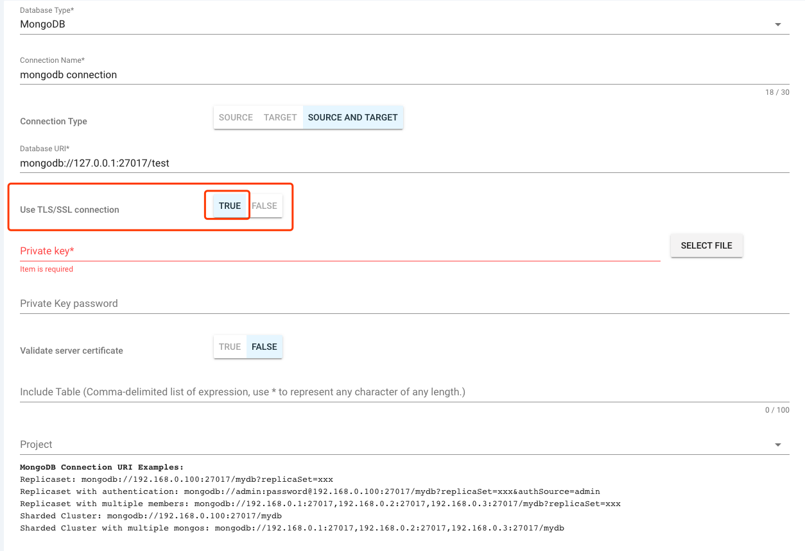
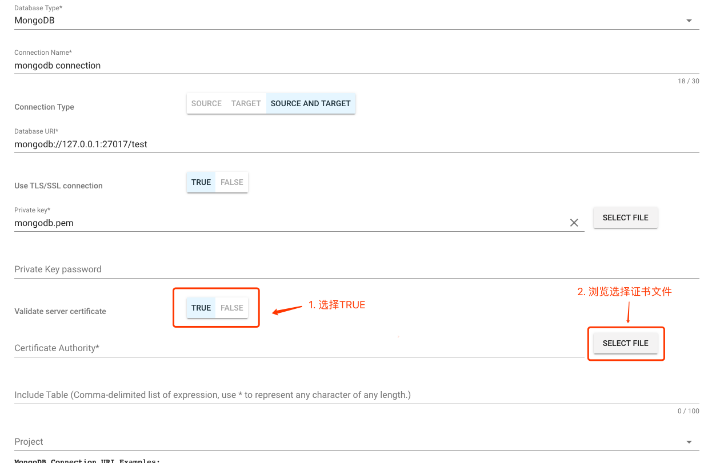
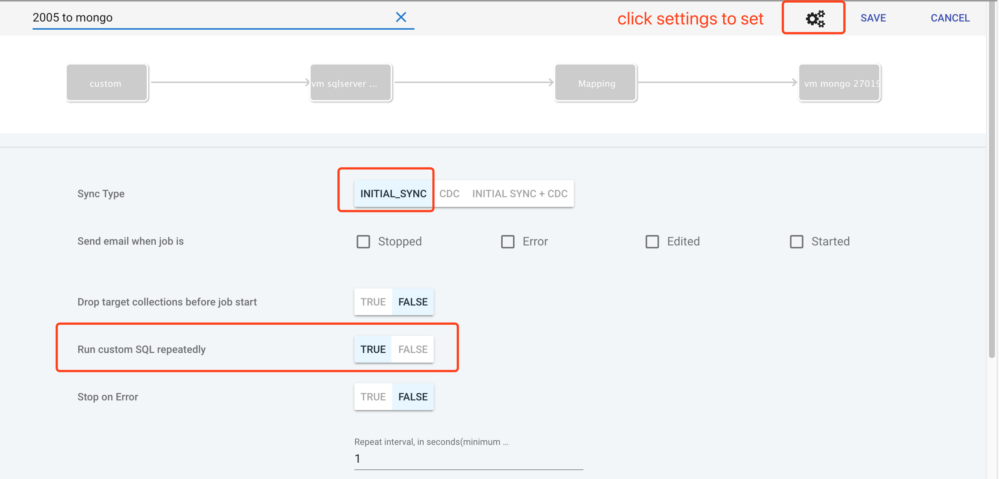
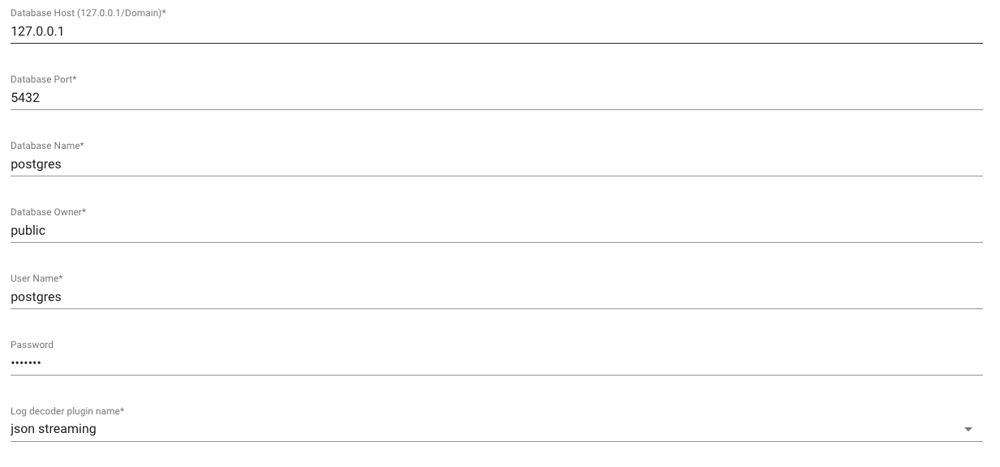

# 连接配置

## 1. MongoDB配置

提供有关配置MongoDB的信息，包括源数据库或目标数据库。

### 1.1 当 MongoDB 作为源数据库时

#### 1.1.1 支持的版本

MongoDB 3.2, 3.4, 3.6, 4.0

#### 1.1.2 基本配置

- 源 MongoDB 必须是复制集或者集群分片。
- 如果您的源 MongoDB 只有一个节点，您可以将其配置为单成员的复制集，以开启 oplog 功能。
- 您应该配置足够的 oplog 空间。 我们建议至少足以容纳 24 小时的 oplog。

#### 1.1.3 用户帐户权限要求

如果源 MongoDB 启用了安全身份验证，则 Tapdata 用于连接源 MongoDB 的用户帐户必须具有分配给用户的以下内置角色：

- clusterMonitor（读取 oplog 的条件）
- readAnyDatabase

要创建具有上述权限的用户，您可以参考以下示例：
```
> use admin
> db.createUser({            
    "user" : "johndoe",
    "pwd"  : "my_password",            
    "roles" : [
        {
            "role" : "clusterMonitor",
            "db" : "admin"
        },
        {
            "role" : "readAnyDatabase",
            "db" : "admin"
        }
    ]
}
```

如果您不希望授予 **readAnyDatabase** 角色，则还可以向特定的数据库以及 "local"和"config" 数据库赋予读取权限。例如：
```
> use admin
> db.createUser({            
    "user" : "johndoe",
    "pwd"  : "my_password",            
    "roles" : [
        {
            "role" : "clusterMonitor",
            "db" : "admin"
        },
        {
            "role" : "read",
            "db" : "my_db"
        }，
        {
            "role" : "read",
            "db" : "local"
        },
        {
            "role" : "read",
            "db" : "config"
        }
    ]
}
```

请注意，只有 MongoDB 版本 3.2 需要**local**数据库的读取权限。

**重要事项**

对于集群分片，您必须在每个分片主节点上创建适当的用户权限。 这是由于MongoDB的安全架构设计。 

当登录到每个单独的分片时，分片服务器不会向config数据库获取用户权限。 相反，它将使用其本地用户数据库进行身份验证和授权。

#### 1.1.4 参考

[MongoDB Documentation: 如何更改oplog的大小](https://docs.mongodb.com/manual/tutorial/change-oplog-size/)

[MongoDB Documentation: 如何将单节点转为复制集](https://docs.mongodb.com/manual/tutorial/convert-standalone-to-replica-set/)

### 1.2 当 MongoDB 作为目标库时

#### 1.2.1 支持的版本：

MongoDB 3.2, 3.4, 3.6, 4.0

#### 1.2.2 基本配置

- 目标 MongoDB 必须是复制集或者集群分片。
- 如果您的源 MongoDB 只有一个节点，您可以将其配置为单成员的复制集，以开启 oplog 功能。这是数据验证功能所需要的。
- 确保为目标 MongoDB 配置了足够的资源来处理源数据库的工作负载。

#### 1.2.3 用户帐户权限要求

如果目标 MongoDB 启用了安全身份验证，则 Tapdata 使用的用户帐户必须具有以下角色 / 权限：
- clusterMonitor（数据验证功能需要使用）
- readWrite（作为目标数据库需要拥有的角色）

要创建具有以上权限的用户：
```
> use admin
> db.createUser({            
    "user" : "johndoe",
    "pwd"  : "my_password",            
    "roles" : [
        {
            "role" : "clusterMonitor",
            "db" : "admin"
        },
        {
            "role" : "readWrite",
            "db" : "my_db"
        },
        {
            "role" : "read",
            "db" : "local"
        }
    ]
}
```

请注意，只有 MongoDB 版本 3.2 需要**local**数据库的读取权限。


### 1.3 同步 MongoDB 集群

当使用 MongoDB 集群作为源库时，Tapdata 会为每个分片创建一个线程，以直接从分片主节点（或次节点）读取数据。

为提高负载性能，我们认为有必要使用这种多线程并行的设计方案。但是需要注意的是，这种方法的副作用是可能会在源集群库中产生孤儿文档。孤立文档是当 MongoDB 发生自动数据迁移所导致的。

要解决此问题，建议在使用MonogoDB集群作为源库同步前，完成以下任务：

**1. 停止平衡器**

有关停止平衡器的详细说明，请参阅此URL。

[MongoDB Documentation: 如何停止平衡器](https://docs.mongodb.com/manual/reference/method/sh.stopBalancer/)


**2. 使用cleanOrphan命令**

[MongoDB Documentation: 如何清理孤儿文档](https://docs.mongodb.com/manual/reference/command/cleanupOrphaned/)

### 1.4 MongoDB TLS/SSL配置

**1. 启用TLS/SSL**



**2. 设置MongoDB PemKeyFile**

点击SELECT FILE，选择证书文件，若证书文件有密码保护，则在Private Key password中填入密码


**3. 设置CAFile**



## 2. Oracle配置

本文档提供有关设置Oracle实时同步的信息

Oracle 实时同步基于Oracle Redo Log，因此需要提前执行某些配置。

### 2.1 开启 LogMiner

- 以具有 DBA 权限的用户身份登录数据库
- 查看数据库的 logging mode :`select log_mode from v$database;`
- 如果返回的结果是 ARCHIVELOG , 您可以直接跳到2.2。
- 如果返回的结果是 NOARCHIVELOG , 继续按照以下步骤操作:
- 关闭数据库: `shutdown immediate;`
- 启动并挂载数据库: `startup mount;`
- 开启存档并打开数据库:

    ```
    alter database archivelog;
    alter database open;
    ```
	 
### 2.2 开启 Supplemental Logging

    ```
    alter database add supplemental log data;
    alter system switch logfile;
    ALTER DATABASE ADD SUPPLEMENTAL LOG DATA (ALL) COLUMNS;
    ```

### 2.3 Oracle 10g 和 11g 的特殊配置方法

#### 2.3.1 创建用户帐户并分配权限

```
CREATE USER <user name> IDENTIFIED BY <password>;
GRANT create session, alter session, execute_catalog_role, select any dictionary, select any transaction, select any 
table to <user name>;
``` 

### 2.4 Oracle 12C 的特殊配置方法

#### 2.4.1 开启 Supplemental Logging

使用以下命令，确认 supplemental logging 是否开启
```
SELECT supplemental_log_data_min, supplemental_log_data_pk, supplemental_log_data_all FROM v$database;
```

如果返回的三列都是 Yes 或者 Implicit ，则表示 identification key logging(标识键日志)和 full supplemental logging（全补充日志）已同时开启，您可以跳到 [创建用户账号](#id14)

如果返回的前两列是 Yes 或者 Implicit ，则表示只开启了 identification key logging(标识键日志)。如果这个能满足您的需求，则可以跳到[创建用户账号](#id14)

#### 2.4.2 开启 identification key(标识键日志)、full supplemental logging（全补充日志）

当使用 12c 的 PDB 时，最佳做法是为容器的表开启日志，而不是对整个数据库开启日志。您可以先使用以下命令将更改应用于容器：
```
ALTER SESSION SET CONTAINER=<pdb>;
```
  
为单个表开启identification key(标识键日志)：
```
ALTER DATABASE ADD SUPPLEMENTAL LOG DATA;    
ALTER TABLE <schema name>.<table name> ADD SUPPLEMENTAL LOG DATA (PRIMARY KEY) COLUMNS;
```

对所有表开启identification key(标识键日志)：
```
ALTER DATABASE ADD SUPPLEMENTAL LOG DATA (PRIMARY KEY) COLUMNS;
```

单表开启full supplemental logging（全补充日志）：
```
ALTER DATABASE ADD SUPPLEMENTAL LOG DATA;
ALTER TABLE <schema name>.<table name> ADD SUPPLEMENTAL LOG DATA (ALL) COLUMNS;
```

所有表开启full supplemental logging（全补充日志）：
```
ALTER DATABASE ADD SUPPLEMENTAL LOG DATA (ALL) COLUMNS;
```

提交更改的配置：
```
ALTER SYSTEM SWITCH LOGFILE;
```

#### 2.4.3 创建用户账号

**Oracle 12c multitenant databases**
- 在 Oracle 12c 的多租户环境下创建用户，必须在 cdb 中创建，并且命名格式约定为：`c##<name>`
    - 1.以具有 DBA 权限的用户身份登录数据库
    - 2.创建普通用户:
        ```
        ALTER SESSION SET CONTAINER=cdb$root;
        CREATE USER <user name> IDENTIFIED BY <password> CONTAINER=all;
        GRANT create session, alter session, set container, select any dictionary, select any transaction, logmining, execute_catalog_role TO <username> CONTAINER=all;
        ALTER SESSION SET CONTAINER=<pdb>;     
        ```
        根据您对表的权限需求，重复执行最后一个命令来赋予 select 权限。
- 当您配置的是源库连接时，请使用此用户来通过 JDBC 的身份验证。 注意必须使用整个用户名（包括“c ##”）作为JDBC连接的用户名。
 
**Oracle 12c standard databases**

- 在Oracle 12c标准模式下，创建一个用户所必须的权限：
    - 1.以具有DBA权限的用户身份登录数据库
    - 2.创建普通用户:
    ```
    CREATE USER <user name> IDENTIFIED BY <password>;
    GRANT create session, alter session, select any dictionary, select any transaction, logmining, execute_catalog_role TO <username>;
    ```
    根据您对表的权限需求，重复执行最后一个命令来赋予select权限。

### 2.5 已知问题

#### 2.5.1 Oracle 的 connection_time

connect_time 参数将自动断开超时的会话。 默认情况下，它是无限的。

设置此设置后，Tapdata 的实时同步可能无法正常工作。 要检查设置的值，可以使用以下命令：
```
select resource_name, limit from dba_profiles where profile=( select profile from dba_users where username = '<username>');
```


## 3. MySQL 配置

### 3.1 支持的版本

- MySQL 5.6
- MySQL 5.7

### 3.2 开启binlog

必须开启 MySQL 的 binlog ，Tapdata 才能正常完成同步工作。

1. 修改 $MYSQL_HOME/mysql.cnf , 例如:

    ```
    server-id         = 223344
    log_bin           = mysql-bin
    expire_logs_days  = 1
    binlog_format     = row
    ```

    注意：
    - server-id: 对于 MySQL 中的每个服务器和复制客户端必须是唯一的
    - binlog_format：必须设置为row 或者 ROW
    - expire_logs_days：二进制日志文件保留的天数，到期会自动删除。
    - log_bin：binlog 序列文件的基本名称

2. 重启 MySQL

    ```
    /etc/inint.d/mysqld restart
    ```

3. 要验证 binlog 已启用，请在 mysql shell 执行以下命令

    ```
    show variables like 'binlog_format';
    ```

    输出的结果中，format value 应该是"ROW"


4. 给 tapdata 账号授权

    ```
    GRANT SELECT, RELOAD, SHOW DATABASES, REPLICATION SLAVE, REPLICATION CLIENT ON . TO 'tapdata' IDENTIFIED BY 'password';
    ```


## 4. SQL Server 配置

默认情况下，未启用SQLServer 增量复制。为了在SQLServer上执行更改数据捕获，必须事先由管理员明确启用增量复制功能。

**重要：**

- 您必须以 `sysadmin` 的成员身份登录到 `SQLServer Management Studio` 或 `sqlcmd`。
- 增量复制是 SQLServer 2008 及更高版本支持的功能。
- 确保 **SQL 代理** 任务是启动状态（在 `SQLServer Management Studio` 里面左下角)

### 4.1 开启 Sql Server 数据库代理服务

#### 4.1.2 查找 mssql-conf 工具

```
find / -name mssql-conf
```

#### 4.1.3 开启代理服务

```
mssql-conf set sqlagent.enabled true
```

### 4.2 启用数据库增量复制

#### 4.2.1 数据库启用增量复制

```
use <数据库名称>
go
EXEC sys.sp_cdc_enable_db
go
```

其中 `<数据库名称>` 是要启用增量复制的数据库。

#### 4.2.2 检查数据库是否启用增量复制

```
SELECT [name]，database_id，is_cdc_enabled
FROM sys.databases
WHERE [name] = N'<数据库名称>'
go
```

其中 `<数据库名称>` 是您要复制的数据库。

### 4.3 表开启增量复制

#### 4.3.1 启用增量复制

```
use<数据库名称>
go
EXEC sys.sp_cdc_enable_table
@source_schema = N'<Schema>'，
@source_name = N'<Table>'，
@role_name = N'<Role>'
go
```

说明：
- `<Schema>` 如 `dbo`。
- `<Table>` 是数据表的名称(没有 schema )。
- `<Role>` 是可以访问更改数据的角色。如果您不想使用选通角色，请将其设置为 “NULL” 。

请注意，如果在启用增量复制时指定了 "\<Role>"，则必须确保提供给 Tapdata 的数据库用户名具有适当的角色，以便 Tapdata 可以访问增量复制表。

#### 4.3.2 检查是否为表启用了增量复制

```
use <数据库名称>
go
SELECT [name]，is_tracked_by_cdc
FROM sys.tables
WHERE [name] = N'<table>'
go
```

### 4.4 版本低于 2008 的 CDC

MSSQL 从 SQLServer 2008 开始提供 CDC 支持。对于较早的版本，必须使用 “custom sql” 功能来模拟更改数据捕获。在从旧版本复制数据时，需要考虑以下几点。

#### 4.4.1 先决条件

```
源表必须有一个更改跟踪列，比如“LAST_UPDATED_TIME”，它在每次插入或更新记录时都会更新。
```

1. 在任务设置界面
    - 确保只选择 **INITIAL_SYNC** ，因为不支持 CDC
    - 将“重复运行自定义 SQL ”设置为 True。这将导致重复执行定制 SQL。

    

    
2. 在映射设计上提供适当的自定义 SQL

    

    

    
### 4.5 参考文献

- [Microsoft文档：启用和禁用增量复制](https://docs.microsoft.com/en-us/sql/relational-databases/track-changes/enable-and-disable-change-data-capture-sql-server?view=sql-server-2017)
- [Microsoft文档：管理和监视增量复制](https://docs.microsoft.com/en-us/sql/relational-databases/track-changes/administer-and-monitor-change-data-capture-sql-server?view=sql-server-2017)


## 5. Sybase 配置

本文档提供有关配置 Sybase ASE 的信息

在 Sybase ASE 数据库中通常有三种处理 CDC 的方法：
- Sybase Replication Server
- 通过增量数据列同步
- 触发器模式

Sybase Replication Server 不支持将 MongoDB 作为输出，因此它不是 Sybase 支持的解决方案 - MongoDB复制。

通过更改跟踪列的增量加载需要复制表以具有更改跟踪列。例如，每次在该行上执行插入/更新/删除操作时，使用当前时间戳更新的 LAST_UPDATED 列。此方法不需要数据库的任何配置。

如果增量加载方法不可用，则可以使用触发器模式。此方法在插入/更新/删除操作上为每个需要复制的表创建触发器。每个 DML 操作都会将记录添加到 CDC 表中。 

Tapdata 将监视 CDC 表以检索发生在 CDC 表中的最新通道。

### 5.1 触发器模式机制

使用触发器模式时，Tapdata 会自动为每个表创建一个触发器。过程如下：
- 创建一个新 Schema（仅限一次）来保存 CDC 表
- 对于需要复制的每个表，在新的schema中创建 CDC 表
- 为每个表创建触发器

这些数据库配置操作在作业启动时执行，并由 Tapdata 自动执行。 Tapdata 将要求用户具有以下角色
- sa
- sso


## 6. 文件配置

本文档提供有关配置 Excel、CSV、Json、XML 的信息。

数据库类型为“File(s)”的，允许接受 Excel、CSV、Json、XML 文件作为源数据库。

用户可通过正则表达式选择采集什么类型的文件。

### 6.1 当 Excel/CSV 作为源时

#### 6.1.1 支持的版本

- Excel：xls、xlsx
- CSV：分隔符自定义

#### 6.1.2 基本配置

1. 文件存放规则
    - 一个文件表示一张表，包括 Excel 和 CSV

2. 文件内容
    - 第一行必须是header(字段名)
    - 第二行开始是数据行

3. 目前支持的文件获取方式有：
    - FTP
    - 本地目录（共享目录）

#### 6.1.3 页面配置

1. 创建连接，“数据库类型”选择“File(s)”

2. “协议”选择“Local File”

3. “文件保存时间”即通过该连接采集到的文件生命周期，单位为分钟

4. “目录/文件”允许用户添加多个路径，以下是每个输入框的解释：
    - “路径”：填写的是绝对路径，**注意：**这里只能填写路径，不需要填写具体文件名
    - “包含文件名”：正则表达式填写的就是您希望获取的文件
    - “排除文件名”：正则表达式填写的就是您希望排除的文件
    - 例如：
        - 路径： /home/dianke/files/
        - 包含文件名：.*.xlsx
        - 排除文件名：<空>

5. 若“协议”选择“FTP”后，只需要填入对应的ftp地址、端口、账号名、密码即可。
    - FTP的连接超时时间用来控制用户连接ftp后的超时时间。
    - FTP的数据传输超时时间用来控制采集文件时的超时时间。

6. FTP主动模式和被动模式：
    - 这里的主被动模式就是指FTP本身的2种模式
    - 建议：使用被动模式，缓解服务器压力

### 6.2 当 Json 作为源时

#### 6.2.1 支持的版本

- 列表Json：

    ```
    [
        {...},
        {...},
        ...
    ]
    ```

- 一行一个字典

    ```
    {...}
    {...}
    ...
    ```

#### 6.2.2 页面配置

同 Excel/CSV 配置

举例：

- 路径： /home/dianke/files/
- 包含文件名：.*.json
- 排除文件名：<空>


### 6.3 当 XML 作为源时

#### 6.3.1 支持的版本

- 标准XML格式

    ```xml
    <DATA>
        <RECORD>
            <NAME>...</NAME>
            <AGE>...</AGE>
            ...
        </RECORD>
        <RECORD>
        ...
        </RECORD>

        ...

    </DATA>
    ```

#### 6.3.2 页面配置

同 Excel/CSV 配置

举例：

- 路径： /home/dianke/files/
- 包含文件名：.*.xml
- 排除文件名：<空>


## 7. GridFS 配置

本文档提供有关配置 GridFS 的信息，该连接支持源和目标数据库。

### 7.1 当 GridFS 作为目标时

#### 7.1.1 配置

1. 数据库URI：MongoDB 的连接字符串

2. 前缀：默认 GridFS 会将文件存储到”fs.files“ 和 ”fs.chunks“ 的集合中，为了区分业务，支持自定义命名空间

    例如：填写 excel ，那么文件将存储到“excel.files” 和 “excel.chunks” 中

3. GridFS 上传文件块大小(Byte)：当 GridFS 上传模式为“流式”时，该值用来限制每次读取多少大小数据到内存中，在写入到 GridFS 中。

4. Gridfs上传模式：选择数据写入的模式

### 7.2 当 GridFS 作为源时

#### 7.2.1 配置

1. 数据库URI：MongoDB 的连接字符串

2. 前缀：已经在 GridFS 中存在的集合前缀

3. “包含的文件”和“不包含的文件” 可以通过正则表达式匹配。这里这需要填写文件名即可

4. “文件类型”：

    - “CSV/EXCEL”
        - 分隔符即是 CSV 中的数据单元格分隔符
    - ”JSON“
        - “ArrayBegin”：[{}, {}, ...]

        ```
        [
            {...},
            {...},
            ...
        ]
        ```

        - “ObectBegin”：
        
        ```
        {...}
        {...}
        ...
        ```

    - “XML”：
        - 这里的path是指您的xml文件中的一条数据的path
        - 举例：

        ```xml

        <info>
            <object id="E68519DF-E8E1-4C55-9231-CB381DE1CC5A">
                <rect lefttopx="168" lefttopy="168" rightbottomx="313" rightbottomy="340"></rect>
                <type>21</type>
                <descriinfo></descriinfo>
                <modifydate>2018-05-08 17:04:07</modifydate>
            </object>
            <object id="E68519DF-E8E1-4C55-9231-CB381DE1CC5A">
                <rect lefttopx="168" lefttopy="168" rightbottomx="313" rightbottomy="340"></rect>
                <type>21</type>
                <descriinfo></descriinfo>
                <modifydate>2018-05-08 17:04:07</modifydate>
            </object>
            <object id="E68519DF-E8E1-4C55-9231-CB381DE1CC5A">
                <rect lefttopx="168" lefttopy="168" rightbottomx="313" rightbottomy="340"></rect>
                <type>21</type>
                <descriinfo></descriinfo>
                <modifydate>2018-05-08 17:04:07</modifydate>
            </object>
        </info>
        ```

        如果您的数据是 `<object></object>` 标签包含的，那么您应该填写 `/info/object/`
        
## 8. PostgreSQL配置

### 8.1 PostgreSQL作为源端，进行增量同步说明

#### 8.1.1 cdc原理

PostgreSQL的逻辑解码功能最早出现在9.4版本中，它是一种机制，允许提取提交到事务日志中的更改，并通过输出插件以用户友好的方式处理这些更改。此输出插件必须在运行PostgreSQL服务器之前安装，并与一个复制槽一起启用，以便客户端能够使用更改。

#### 8.1.2 提供的cdc支持

- 逻辑解码（Logical Decoding），用于从 WAL 日志中解析逻辑变更事件
- 复制协议（Replication Protocol）：提供了消费者实时订阅（甚至同步订阅）数据库变更的机制
- 快照导出（export snapshot）：允许导出数据库的一致性快照（pg_export_snapshot）
- 复制槽（Replication Slot），用于保存消费者偏移量，跟踪订阅者进度。

所以，根据以上，我们需要安装逻辑解码器，现有提供的解码器如下

<span id="plugins">

|解码器|pg版本|tapdata是否支持|输出格式|
|:-:|:-:|:-:|:-:|
|[decoderbufs](https://github.com/debezium/postgres-decoderbufs)|9.6+|❌|protobuf|
|[wal2json](https://github.com/eulerto/wal2json)|9.4+|✔️|json|
|pgoutput|10.0+|❌️|pg log|
|test_decoding|9.4+|❌|text|
|decoder_raw|9.4+|❌|SQL|

PostgreSQL支持的最低版本：9.4+

#### 8.1.3 准备工作

安装插件

- [decorderbufs](https://github.com/debezium/postgres-decoderbufs)，依赖
	- [Protobuf-c 1.2+](https://github.com/protobuf-c/protobuf-c), [protobuf安装参考](https://blog.csdn.net/gumingyaotangwei/article/details/78936608)
	- [PostGIS 2.1+](http://www.postgis.net/)
- [wal2json](https://github.com/eulerto/wal2json/blob/master/README.md)
- pgoutput(pg 10.0+)

以wal2json为例，安装步骤如下

1. 确保环境变量PATH中包含"<postgres安装路径>/bin"

```
export PATH=$PATH:<postgres安装路径>/bin
```

2. 安装插件

```
git clone https://github.com/eulerto/wal2json -b master --single-branch \
&& cd wal2json \
&& USE_PGXS=1 make \
&& USE_PGXS=1 make install \
&& cd .. \
&& rm -rf wal2json
```

#### 8.1.4 配置文件

- postgresql.conf

如果你正在使用一个支持的逻辑解码插件(不能是pgoutput)，并且它已经安装，配置服务器在启动时加载插件:

```
shared_preload_libraries = 'decoderbufs,wal2json'
```

配置replication

```
# REPLICATION
wal_level = logical
max_wal_senders = 1 // 大于0即可
max_replication_slots = 1 // 大于0即可
```

#### 8.1.5 权限

用户需要有replication、login权限

```
CREATE ROLE name REPLICATION LOGIN;
```

pg_hba.conf

```
local   replication     <youruser>                     trust
host    replication     <youruser>  127.0.0.1/32       trust
host    replication     <youruser>  ::1/128            trust
```

以上只是基本权限的设置，实际场景可能更加复杂

#### 8.1.6 测试日志插件是否可用

**以下操作建议在POC环境进行**

- 连接postgres数据库，切换至需要同步的数据库，创建一张测试表

	```
	// 假设需要同步的数据库为postgres，模型为public
	\c postgres
	
	create table public.test_decode
	(
	    uid    integer not null
	        constraint users_pk
	            primary key,
	    name   varchar(50),
	    age    integer,
	    score  decimal
	)
	```

可以根据自己情况创建一张测试表

- 创建slot连接，以[wal2json](#plugins)插件为例


	```
	select * from pg_create_logical_replication_slot('slot_test', 'wal2json')
	```

- 创建成功后，对测试表插入一条数据


- 监听日志，查看返回结果，是否有刚才插入操作的信息

	```
	select * from pg_logical_slot_peek_changes('slot_test', null, null)
	```
	
- 成功后，销毁slot连接，删除测试表

	```
	select * from pg_drop_replication_slot('slot_test')
	
	drop table public.test_decode
	```

#### 8.1.7 创建连接

1. 数据库类型：PostgreSQL
2. 连接类型：源头/源头和目标
3. 填写数据库连接信息

4. 选择日志解码器

	- json streaming: [wal2json插件](#plugins)*(默认项)*
	- json streaming on rds: [wal2json插件，用于云rds服务](#plugins)
	- pgoutput: [pgoutput插件](#plugins)


#### 8.1.8 异常处理

##### Slot清理

如果tapdata由于不可控异常（断电、进程崩溃等），导致cdc中断，会导致slot连接无法正确从pg主节点删除，将一直占用一个slot连接名额，需手动登录主节点，进行删除

1. 查询slot信息

	```
	// 查看是否有slot_name=tapdata的信息
	
	TABLE pg_replication_slots;
	```
	如图
	

2. 删除slot节点

	```
	select * from pg_drop_replication_slot('tapdata');
	```

##### 删除操作

在使用wal2json插件解码时，如果源表没有主键，则无法实现增量同步的删除操作